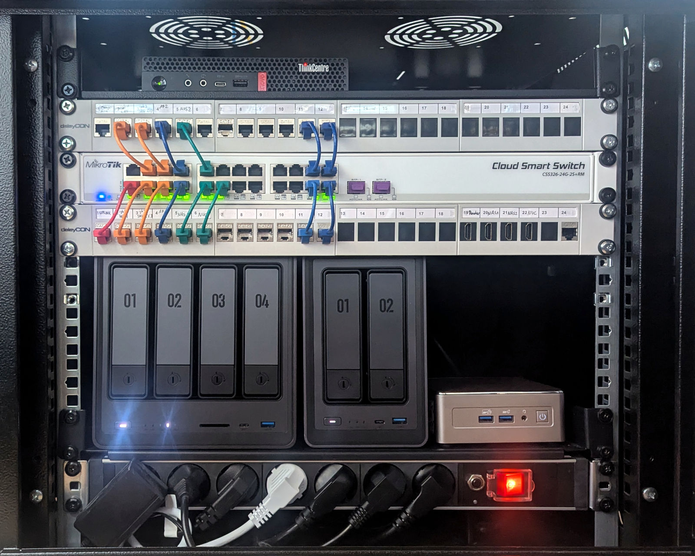

## Einleitung

Mein Homelab - eine Umgebung, um das lokale Netzwerk bereitzustellen, Dienste zu hosten und vor allem, um zu lernen. 

Angefangen hat alles vor vielen Jahren mit einem einzelnen Raspberry Pi 1 Model B+, obwohl das damals eher eine Spielerei für mich war. Ich habe zwar den einen oder anderen Service eingerichtet und meine ersten Versuche mit Linux gemacht, aber es war nie etwas Dauerhaftes. Erst während meines Studiums habe ich mich intensiver mit Linux beschäftigt und angefangen, es aktiv zu nutzen.

Als ein paar Freunde im Jahr 2021 einen neuen Minecraft-Server starten wollten, beschloss ich, die Sache selbst in die Hand zu nehmen. Da der Stromverbrauch eine Rolle spielte und ich ein Gerät mit geringem Platzbedarf und dennoch ausreichender Leistung wollte, besorgte ich einen Intel NUC mit einem Intel i5-8259U.

Seitdem hoste ich Dienste und habe die Umgebung immer weiter ausgebaut und aktualisiert - und es gibt immer noch viel zu lernen, auszuprobieren und zu implementieren. 

## Momentaner Stand

### Rack

Der Kern des Homelabs ist in einem Netzwerk-Rack zu finden:

Von oben nach unten & links nach rechts:

#### Router

Als Router läuft **OPNsense** auf einem **ThinkCentre Tiny M720q**, ausgestattet mit einem Intel Core i3-8100T, 8 GiB DDR4 und einer Intel i340-T4 Netzwerkkarte.

Neben mehreren Netzwerken samt VLANs und den üblichen Diensten wie DNS und DHCP werden hierüber unter anderem auch weitere nützliche Dienste wie VPN-Server und DynDNS-Updater betrieben.

#### Patchfelder & Core-Switch

Als Core-Switch dient ein **MikroTik CSS326-24G-2S+RM** mit SwOS. 

Die Patchfelder sind auf der linken Seite mit RJ45 Keystone-Modulen bestückt und mit farbigen Patchkabeln verbunden:

| Farbe | Bedeutung |
| -- | -- |
| Rot | Upink (WAN) |
| Orange | Uplink (Router) |
| Blau (Links) | Access Points |
| Grün | Server |
| Blau (Rechts) | Clients |

Auf der rechten Seite sind eine Handvoll HDMI Keystone-Module eingesetzt, die einen einfachen Zugang zu den HDMI-Steckplätzen der im Rack installierten Geräte ermöglichen.

#### NAS 1

Das Haupt-NAS ist ein **UGREEN NASync DXP4800**, ausgestattet mit einem Intel N100 sowie 16 GiB DDR5, auf dem **TrueNAS Scale** läuft.

Für Daten stehen zwei Pools zur Verfügung: Ein MIRROR aus 2 Festplatten je 16 TiB sowie ein MIRROR aus 2 Festplatten je 6 TiB.

#### NAS 2

Dieses NAS dient als Backup-System für das Hauptnas und ist ein **UGREEN NASync DXP2800**. 

Wie das Haupt-NAS ist es mit einem N100 ausgestattet wird mit TrueNAS Scale betrieben, wobei es nur 8 GiB DDR5 hat und die Pools nicht aus einem MIRROR, sondern nur aus einzelnen Platten bestehen.

#### Server

Als Host für die meisten Dienste, die ich lokal hoste, ist ein **Geekom A5** mit AMD Ryzen 7 5825U und 64 GiB DDR4 im Einsatz. Auf dem Rechner selbst läuft **Proxmox Virtual Environment** als Hypervisor, die Dienste werden in VMs oder LXC betrieben.

#### Basic PDU

Eine einfache Steckdosenleiste, die im Rack verschraubt ist. Neben den Geräten im Rack sind auch PoE-Injektoren für die Access Points angeschlossen und hinter der PDU zu finden.

### Externe Komponenten

#### Access Points

Um das WLAN bereitzustellen, werden zwei Access Points von **Ubiquiti** verwendet: Ein **UAP-AC-Pro** und ein **UAP-AC-Lite**.
