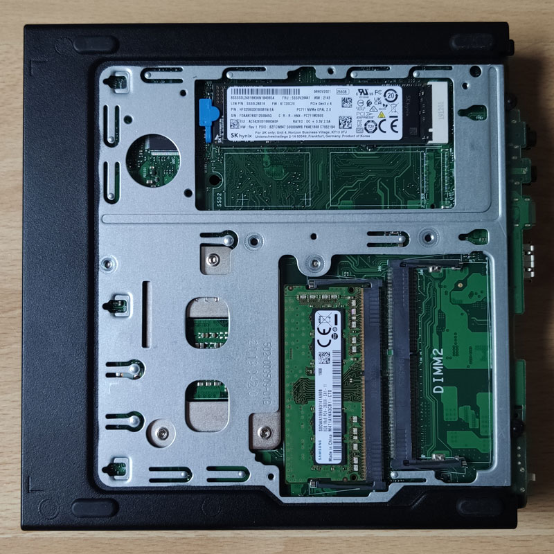
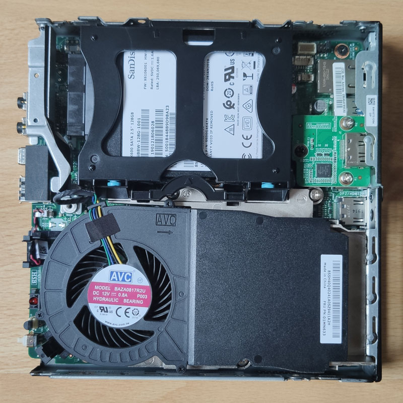
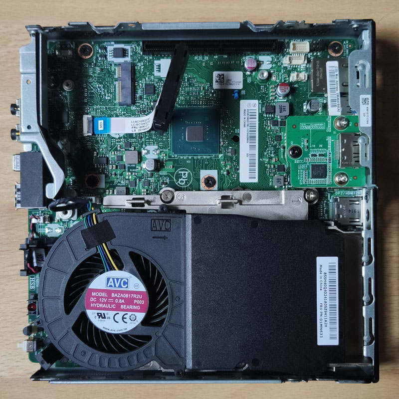
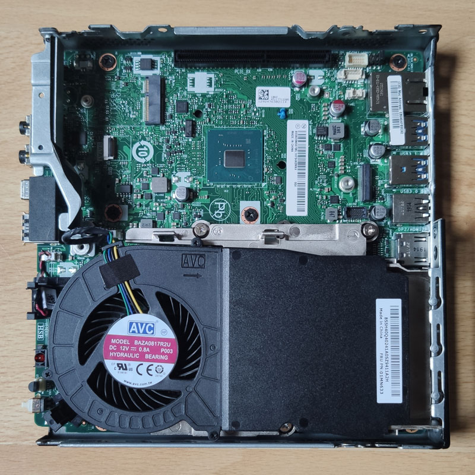
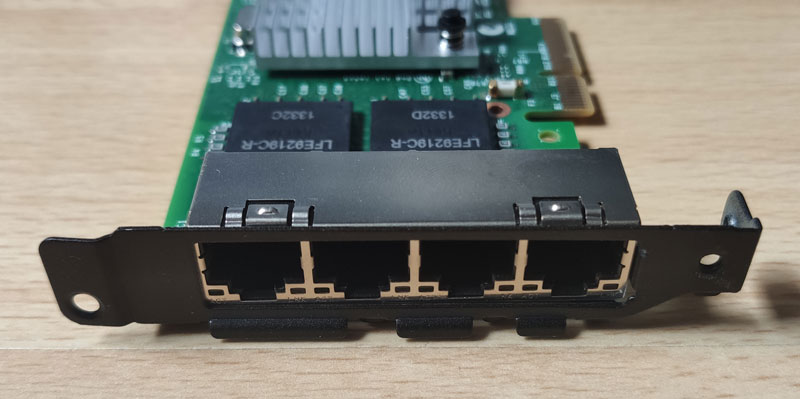
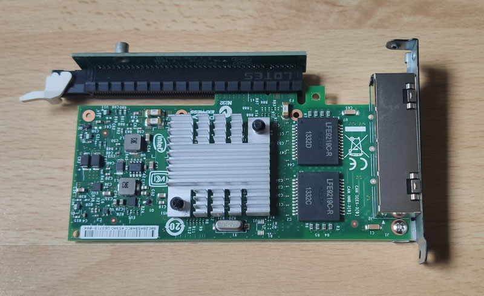
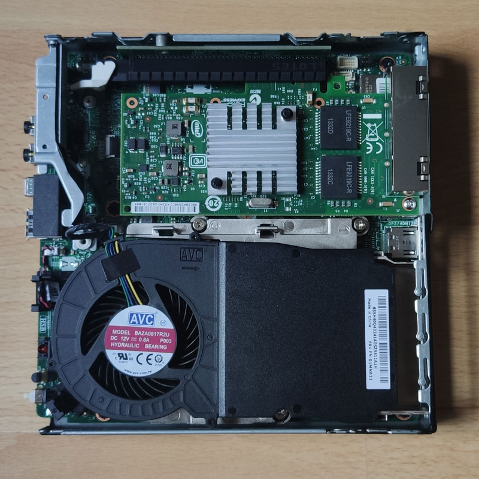
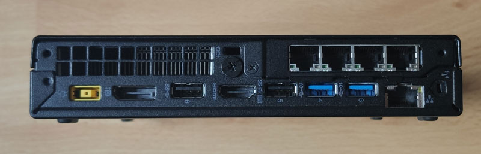

## Aktuelles Setup

Bislang verwende ich OPNsense auf einem HP T620 Plus - einem Thin Client mit einem AMD GX-420CA, 4 GB RAM und 8 GB Speicher. Ähnliche CPUs der Serie finden sich auch in anderen Appliances wie den APU-Boards von PC Engines oder dem DEC675 von Deciso.

Im Gegensatz zum normalen T620 bietet es die Möglichkeit, eine vollwertige PCIe-Erweiterungskarte zu installieren. Das macht ihn für den Einsatz als Router interessant, da man problemlos eine Netzwerkkarte wie eine Intel i350 einbauen kann. Da mein Setup schon seit einiger Zeit existiert und es zu dieser Zeit keine guten Angebote für eine gebrauchte i350 gab, verwende ich eine i340-T4 von IBM (Modell 94Y5167) in meinem T620 Plus.

Obwohl dieses Setup gut funktioniert, habe ich darüber nachgedacht, den Router zu ersetzen. Zum einen stört es mich ein wenig, dass der Steckplatz für die Erweiterungskarten vertieft und nicht flach mit den übrigen I/O-Anschlüssen ist - das Umstecken der Netzwerkkabel ist immer ein wenig fummelig, auch wenn es nicht so oft vorkommt. Andererseits möchte ich auch ein bisschen zukunftssicherer sein, was die Leistung angeht, z.B. wenn ich eine bessere Internetverbindung bekomme, das Netzwerk erweitern oder mehr Dienste auf dem Router selbst laufen lassen möchte.

## Suche nach einer neuen Plattform

Ich habe mich also ein wenig umgesehen und suche eine neue Plattform für OPNsense. 
Ich möchte weder ein kleines Vermögen ausgeben, noch möchte ich, dass es nur ein Sidegrade ist - es soll mehr Leistung bieten.

Ich hätte OPNsense auch auf meinem Heimserver virtualisieren können, aber ich habe mich dagegen entschieden - vor allem, weil ich nicht das ganze Netzwerk lahm legen wollte, wenn ich am Virtualisierungshost arbeite.

Da der Router rund um die Uhr läuft, sollte die neue Hardware energieeffizient und nicht zu laut sein, aber auch nicht zu viel Platz beanspruchen. Sie sollte in ein Netzwerk-Rack passen und nicht mehr als 2 HE beanspruchen.

Theoretisch kann OPNsense auch mit nur einem Netzwerkanschluss betrieben werden, wenn VLANs verwendet werden. Es ist jedoch besser, wenn das Gerät mindestens zwei Ports hat - einen für WAN und einen für LAN. Außerdem laufen NICs von Intel nach verschiedenen Erfahrungsberichten besser und zuverlässiger als NICs von Realtek. Der PC sollte also entweder zwei Netzwerkanschlüsse mit einem Intel-Chip dahinter haben oder sich entsprechend erweitern lassen, z.B. über PCIe.

Bisher habe ich für mein Homelab hauptsächlich Mini-PCs verwendet und damit gute Erfahrungen gemacht. Deshalb wollte ich auch weiterhin darauf setzen, auch wenn es aufgrund des kleinen Formfaktors Einschränkungen gibt.

### Lenovo ThinkCentre Tiny

Ich habe den Lenovo ThinkCentre Tiny zunächst nicht viel Aufmerksamkeit geschenkt, weil ich nicht erwartet hatte, eine zusätzliche PCIe-Karte installieren zu können - die Rechner schienen mir einfach zu klein. 

Dann stolperte ich über die folgenden Beiträge des Benutzers [Parallax](https://smallformfactor.net/forum/members/parallax.19841/) im [SmallFormFactor-Forum](https://smallformfactor.net/forum/):

- [[Discussion] Lenovo M720 Tiny and M920 Tiny can support a 4 port NIC for firewall duties](https://smallformfactor.net/forum/threads/lenovo-m720-tiny-and-m920-tiny-can-support-a-4-port-nic-for-firewall-duties.13915/)
- [[Log] Lenovo M720Q Tiny router/firewall build with aftermarket 4 port NIC](https://smallformfactor.net/forum/threads/lenovo-m720q-tiny-router-firewall-build-with-aftermarket-4-port-nic.14793/)

Nach Angaben des Autors verfügen neuere Versionen des ThinkCentre Tiny (M720Q, M920Q, M920x, P340 und möglicherweise weitere Modelle) über einen Anschluss auf dem Mainboard, der wohl *"physisch und funktionell einem PCIe-Steckplatz ähnelt, aber eigentlich keiner ist"*.

Um einen ThinkCentre Tiny als Router zu nutzen, benötigt man:

- einen ThinkCentre Tiny mit einem "PCIe"-Steckplatz
- eine Netzwerkkarte wie die Intel i350-T4
- eine PCIe-Riser-Karte (z.B. FRU 01AJ902 für x8, 01AJ940 für x16)
- eine Blende mit den entsprechenden Aussparungen für die Netzwerkkarte.

Die Blende kann separat oder zusammen mit der Riser-Karte gekauft werden, kann aber auch mit einem 3D-Drucker hergestellt werden. In meinem Fall habe ich ein Bundle aus Blende und Riser-Karte für $35,56 (inklusive Versand) bei eBay bestellt.

Wenn der entsprechende Rechner mit einer 2,5"-SATA-SSD kommt, sollte auch eine M.2-SSD (NVMe oder SATA) gekauft und verwendet werden. Im Thread gab es einen Hinweis von User ["Siderean" (Post #20)](https://smallformfactor.net/forum/threads/lenovo-m720q-tiny-router-firewall-build-with-aftermarket-4-port-nic.14793/#post-247864), dass nach dem Einbau einer i340-T4-Karte auch Platz für eine 2,5"-SATA-SSD sei, es aber eng werden würde. Leider wird nicht erwähnt, wie sehr sich dies auf die Wärme im Gehäuse auswirkt, aber ich kann mir gut vorstellen, dass dies zu Problemen führen könnte.

### Meine Wahl: M720q

Das ThinkCentre M720q und M920q kann man mit verschiedenen Prozessoren kaufen, von Intel Pentium bis Intel Core i7. 

Aufgrund der damaligen Verfügbarkeit und des Preises habe ich mich für ein generalüberholtes Lenovo ThinkCentre M720q Tiny mit einem Intel Core i3-8100T, 8 GB RAM und einer 250 GB SSD entschieden, das mich 209€ gekostet hat.

Es wird sowohl in Single- als auch in Multi-Thread-Anwendungen eine deutliche Leistungssteigerung bringen. Gleichzeitig verringert sich auch der Platzbedarf, da es in allen Dimensionen kleiner ist als das T620 Plus. Anstelle von zwei Höheneinheiten wird nur noch ein U benötigt. Es gibt auch eine [Vorlage für eine 1HE-Rackhalterung auf Thingiverse] (https://www.thingiverse.com/thing:4769452), die ich für die Zukunft im Hinterkopf behalten kann - dadurch wird die Ablage frei, die anderweitig genutzt werden kann, auch wenn ich im Moment noch nichts dafür geplant habe.

Die TDP der CPU ist höher als die des aktuellen Geräts. Obwohl dies nicht unbedingt die Leistungsaufnahme widerspiegelt, sondern eher die Wärme, die während des Betriebs abgeführt werden muss, kann es dennoch als Faktor für den Vergleich von Prozessoren verwendet werden. Durch die höhere Leistung sollte der Stromverbrauch vor allem im Idle-Modus jedoch relativ gering sein. 

In meinem Fall war in der Anzeige leider nur von einer *250 GB SSD* die Rede, ohne dass eine Aussage über die Art des Speichers gemacht wurde. Der Rechner wurde dann mit einer 2,5"-SSD geliefert, also habe ich noch eine M.2-SSD bestellt.

## Umbau

Nachdem alles eingetroffen ist, wurde es Zeit für den Umbau. Die vordere Abdeckung, einschließlich des Deckels, ist nur mit einer Schraube an der Rückseite befestigt und kann nach dem Lösen dieser entfernt werden. Dadurch erhält man Zugang zum Inneren des Rechners. Die Abdeckung auf der Unterseite kann auch entfernt werden, um auf den RAM und den M.2-Speicher zuzugreifen.

### RAM & Speicher

Nach dem Entfernen der Unterseite findet man zwei SO-DIMM-Steckplätze für DDR4-RAM und einen M.2-Steckplatz mit Key M und 80 mm Länge.

In meinem Fall war nur einer der RAM-Steckplätze belegt. Als zukünftiges Upgrade könnte ich hier ein zweites Modul installieren, um einen Leistungsschub durch Dual-Channel zu erreichen.

Da NVMe-Speicher anstelle der 2,5"-SATA-SSD verwenden werde, baue ich diese in den entsprechenden Steckplatz ein. Dies geschieht ohne Schrauben, das Laufwerk wird mit einer blauen Kunststoffklammer gesichert. 

Nachdem der Speicher installiert wurde, kann die untere Abdeckung wieder eingesetzt werden.

### Entfernung unnötiger Komponenten

Zurück im Inneren des PCs kann man deutlich die 2,5"-SATA-SSD sehen, die derzeit in der oberen Hälfte installiert ist, sowie die Erweiterungskarte für einen zusätzlichen DisplayPort-Ausgang. Beide werden entfernt, um Platz für die Netzwerkkarte zu schaffen.

Die SATA-SSD ist über ein dünnes Flachbandkabel mit dem Mainboard verbunden. Wie immer bei solchen Kabeln sollte man sehr vorsichtig damit umgehen - vor allem, wenn man es irgendwann wieder verwenden möchte. Es ist jedoch leicht möglich, das Kabel vollständig zu entfernen, indem man die Halteklammer am Mainboard-Anschluss öffnet und an der kleinen blauen Plastiklasche am Ende des Kabels zieht.

Die Erweiterungskarte mit dem Displayport-Anschluss muss ebenfalls entfernt werden. Dazu muss die schwarze Schraube auf der Platine selbst gelöst werden, aber auch zwei kleinere Schrauben am Gehäuse, die die Blende sichern. Danach kann die Karte herausgezogen werden.

Damit sind die Vorbereitungen abgeschlossen und wir haben genügend Platz für die Netzwerkkarte.

### Einbau der Netzwerkkarte

Zuerst muss die bereits installierte Low-Profile-Blende von der Karte entfernt und anschließend die Blende für den Einbau in das M720q befestigt werden. Beide werden mit nur einer einzigen Schraube an der Netzwerkkarte selbst befestigt.

Die Karte kann dann in den Riser eingesetzt werden, um alles für den Einbau in den Computer vorbereitet zu haben. Wie man deutlich sehen kann, wird nur ein kleiner Teil des PCIe-Steckplatzes benötigt, da die Karte selbst nur eine PCIe x4-Schnittstelle nutzt und der Riser eine x16-Schnittstelle bietet.

Deutlich sichtbar ist das Metallgewinde am Riser (oben links), mit dem dieser später am Gehäuse befestigt wird.

Das gesamte Konstrukt wird dann in den Computer eingebaut, indem der Riser in den entsprechenden Steckplatz auf dem Mainboard eingesetzt wird. Zum Schluss werden drei Schrauben eingesetzt (eine am Riser, zwei an der Blende) und der Umbau ist abgeschlossen.

Zum Schluss wird der Deckel mit der angebrachten Frontabdeckung wieder auf das Gerät geschoben und befestigt.

## Setup von OPNsense

Zuerst habe ich das BIOS aktualisiert. Das ist zwar funktionell nicht notwendig, aber für die Ersteinrichtung auf jeden Fall eine gute Idee. Lenovo bietet im [Supportbereich des M720q](https://pcsupport.lenovo.com/us/en/products/desktops-and-all-in-ones/thinkcentre-m-series-desktops/m720q/10t7/downloads/ds503907-flash-bios-update-thinkcentre-m720t-m720s-m720q-m920t-m920s-m920q-m920x-thinkstation-p330-tiny) das "BIOS Update (USB Drive Package)" an. Das Archiv muss lediglich auf einen FAT32-formatierten USB-Stick entpackt und von diesem gebootet werden.

Danach ist es ratsam, nicht benötigte Komponenten wie den Audio- oder SATA-Controller im BIOS abzuschalten und das System so einzustellen, dass es nach einem Stromausfall automatisch neu startet.

Die Installation von OPNsense selbst ist einfach und unkompliziert mit den [bereitgestellten Images](https://opnsense.org/download/). Da ich das System auch über einen USB-Stick installieren will, habe ich das vga-Image heruntergeladen und es mit [Etcher](https://etcher.balena.io) auf einen Stick geflasht.

Man kann eine bestehende Konfiguration sowohl im Live-Image als auch während der Installation importieren, sofern sie auf einem Datenträger unter `/conf/config.xml` zu finden ist. Aus welchem Grund auch immer hat der Import bei mir nicht funktioniert. Ich vermute, dass es an der Verschlüsselung der Konfigurationsdatei liegt, aber ich habe nicht allzu viel Zeit darauf verwendet.

Das ist aber nicht weiter schlimm, denn man kann die Konfiguration auch im laufenden Betrieb importieren. Ich habe also einen der Ports für LAN konfiguriert, die Installation abgeschlossen und mich dann mit den Standard-Anmeldedaten in der WebUI angemeldet. Unter `System > Configuration > Backups` konnte ich dann die Konfigurationsdatei auswählen und wiederherstellen.

Da ich in meinem alten Setup nur die Ports der Netzwerkkarte und nicht den Onboard-NIC zugewiesen hatte, verlief der Import reibungslos und ohne Fehler in der Schnittstellen-Zuweisung.

Damit ist der Umzug auf die neue Plattform abgeschlossen, und der Computer kann nun seine Aufgaben als Router wahrnehmen.
