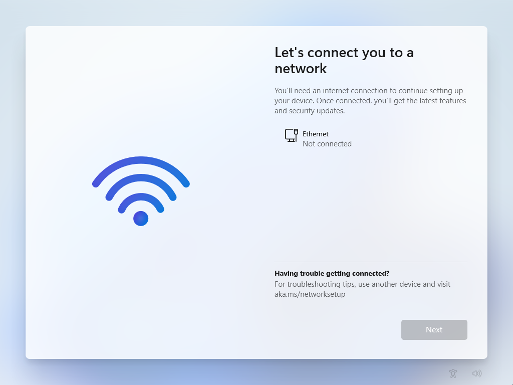
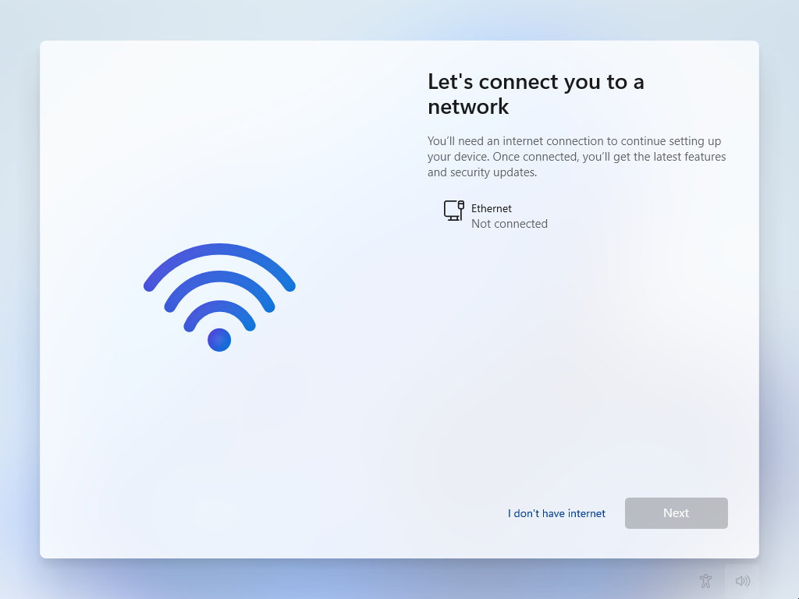

Since Windows 10, Microsoft has been aiming for the computer to be used with a Microsoft account. During setup, it was not possible to set up a local account when connected to the internet. In order to see the option for the local account, you had to remain offline.

This no longer seems to work in the current Windows 11 setup. Microsoft requires an Internet connection to continue with the setup.



Even if it is no longer as trivial as it used to be, this requirement can still be bypassed. To do this, a console can be opened in Setup by pressing <kbd>CTRL</kbd> + <kbd>F10</kbd>. Enter the following command and confirm:

```
OOBE\BYPASSNRO
```

The system then restarts. If you follow the wizard back to the previous step, the option "I don't have internet" is now available:



This allows you to continue with the “restricted setup” and create a local account.
