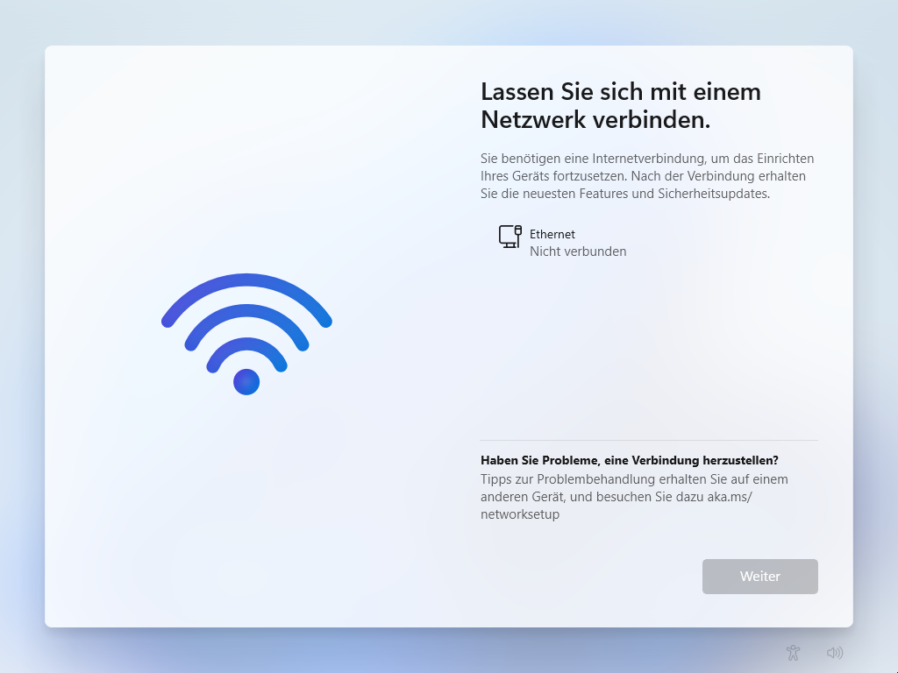
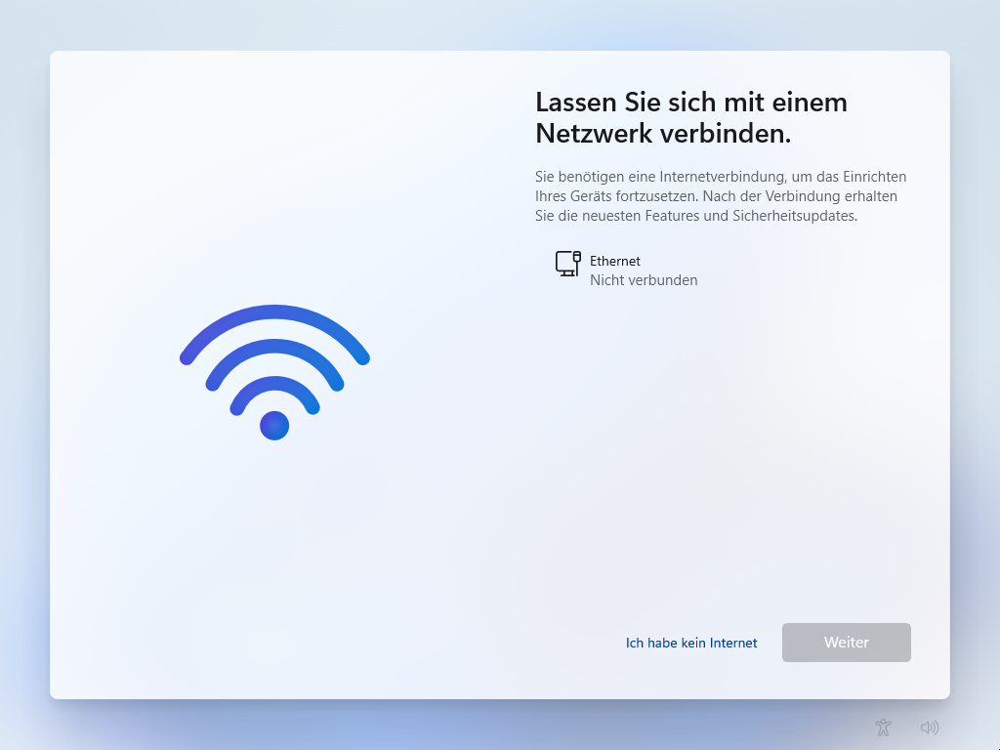

## Erzwungenes Online-Konto

Schon seit Windows 10 strebt Microsoft an, dass der Rechner mit einem Microsoft-Account benutzt wird. Während des Setups konnte man kein lokales Konto einrichten, wenn man mit dem Internet verbunden war. Um die Option für das lokale Konto angezeigt zu bekomen, musste man also offline bleiben.

Im aktuellen Setup von Windows 11 scheint dies nichts mehr zu bringen. Um im Setup fortfahren zu können, fordert Microsoft eine Internetverbindung.



## BYPASSNRO

Auch wenn es nicht mehr so trivial wie früher ist, lässt sich diese Anforderung immer noch umgehen. Hierfür kann im Setup mit der Tastenkombination <kbd>SHIFT</kbd> + <kbd>F10</kbd> eine Konsole geöffnet werden. Dort gibt man folgenden Befehl ein und bestätigt ihn:

```
OOBE\BYPASSNRO
```

Anschließend startet das System neu. Folgt man dem Assistenten wieder bis zum vorherigen Schritt, ist nun die Option "Ich habe kein Internet" verfügbar:



Dadurch kann man mit der "eingeschränkter Einrichtung" fortfahren und ein lokales Konto anlegen.

## ms-cxh

`BYPASSNRO` funktioniert auch noch im aktuellen Installer für Windows 11 24H2. In einem neuen Insider-Build hat Microsoft das Skript entfernt und es ist nur eine Frage der Zeit, bis das auch in einem Release umgesetzt wird. Man kann den Online-Zwang durch manuelles Setzen eines Registry-Werts immer noch umgehen, aber der ganze Prozess ist komplexer geworden.

Es wurde jedoch ein weiterer, komfortabler Befehl entdeckt. Auch hierfür öffnet man mit <kbd>SHIFT</kbd> + <kbd>F10</kbd> eine Konsole und gibt dann folgenden Befehl ein:

```
start ms-cxh:localonly
```

Nach Eingabe des Befehls öffnet sich ein Fenster, in dem die Benutzerdaten des lokalen Kontos abgefragt werden. Anschließend wird Windows 11 direkt eingerichtet.
