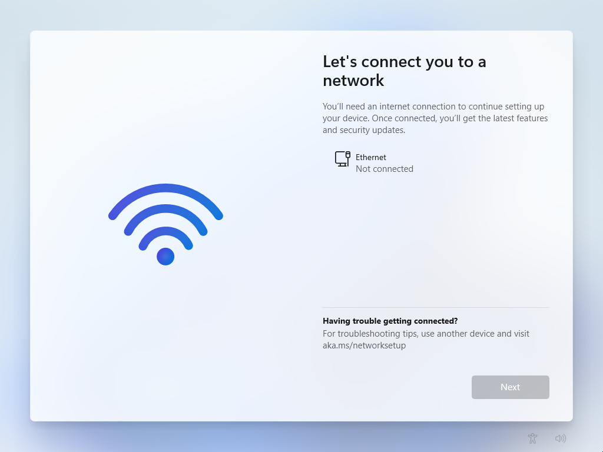
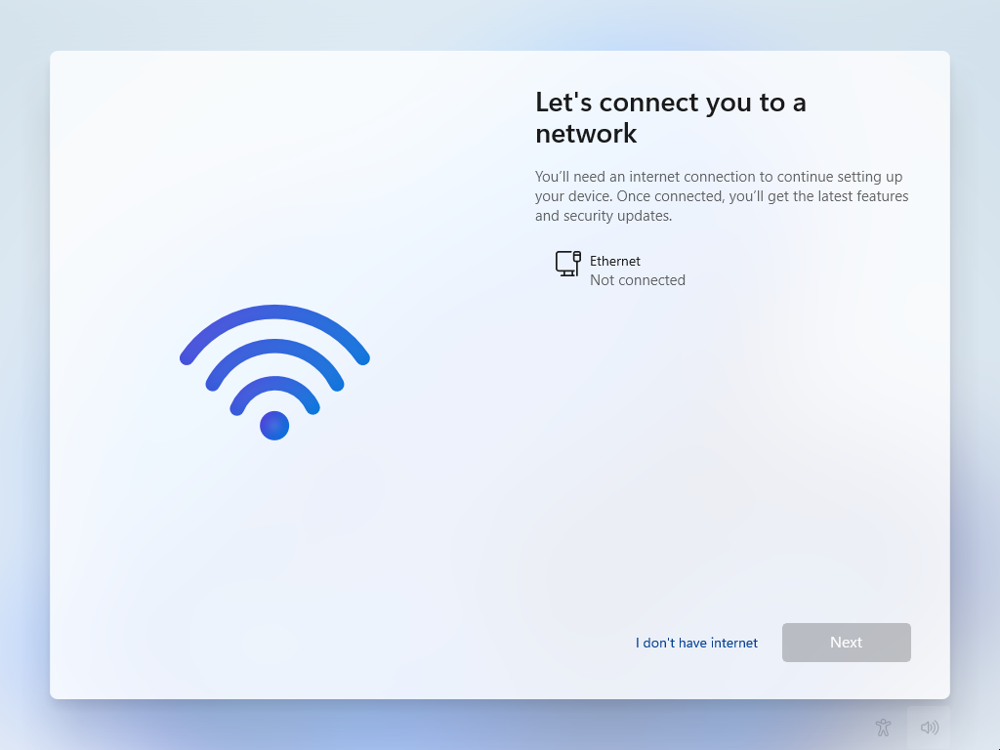

## Forced Online Account

Since Windows 10, Microsoft has been aiming for the computer to be used with a Microsoft account. During setup, it was not possible to set up a local account when connected to the internet. In order to see the option for the local account, you had to remain offline.

This no longer seems to work in the current Windows 11 setup. Microsoft requires an Internet connection to continue with the setup.



## BYPASSNRO

Even if it is no longer as trivial as it used to be, this requirement can still be bypassed. To do this, a console can be opened in Setup by pressing <kbd>SHIFT</kbd> + <kbd>F10</kbd>. Enter the following command and confirm:

```
OOBE\BYPASSNRO
```

The system then restarts. If you follow the wizard back to the previous step, the option "I don't have internet" is now available:



This allows you to continue with the “restricted setup” and create a local account.

## ms-cxh

`BYPASSNRO` still works in the current installer for Windows 11 24H2. Microsoft has removed the script in a new Insider build and it is only a matter of time before this is also implemented in a release. The online requirement can still be bypassed by manually setting a value in the registry, but the whole process has become more complex as a result.

However, another convenient command was discovered
This is also done by opening a console with <kbd>SHIFT</kbd> + <kbd>F10</kbd> and then entering the following command:

```
start ms-cxh:localonly
```

After entering the command, a window opens asking for the user data of the local account. Windows 11 is then set up directly.
