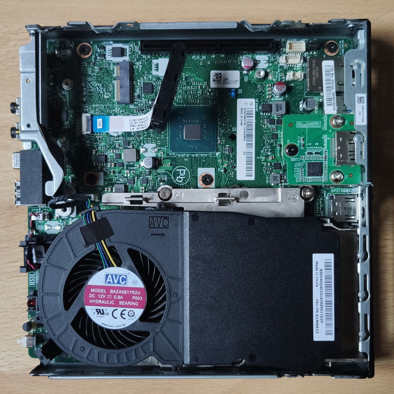

## Current Setup

So far I'm using OPNsense on an HP T620 Plus - a thin client with an AMD GX-420CA, 4GB RAM and 8GB storage. Similar CPUs in the series can also be found in other appliances such as the APU boards from PC Engines or the DEC675 from Deciso.

In contrast to the normal T620, it offers the option of installing a fully-fledged PCIe expansion card. This makes it interesting for use as a router, as you can easily install a network card like an Intel i350. Since my setup has been around for some time and there were no good deals for an used i350 at the time, i use an i340-T4 from IBM (Model 94Y5167) in my T620 Plus.

Even though this setup works fine, I have given some thought to replacing the router. For once, it bothers me a bit that the slot for expansion cards is recessed and not flat with the rest of the I/O ports - reconnecting the network cables is always a bit fiddly, even if it doesn't happen that often. On the other hand, I would also like to be a bit more future-proof in terms of performance, e.g. if I get a better internet connection, expand the network or want to run more services on the router itself.

## Looking for a new platform

So I ended up looking around a bit and looking for a new platform for OPNsense. 
I don't want to spend a small fortune, nor do I want it to be just a sidegrade, but I want it to offer more performance.

I could have virtualized OPNsense on my home server, but I decided against it - mainly because I didn't want to bring the whole network down when working on the virtualization host.

As it runs 24/7, the new hardware should be energy-efficient and not too loud, but also not take up too much space. It should fit into a network rack and take up no more than 2U.

Theoretically, OPNsense can also be used with only one network port if VLANs are utilized. However, it is better if the unit has at least two ports - one for for WAN and one for LAN. In addition, Intel NICs run better and more reliably than Realtek NICs according to various experience reports. The PC should therefore either have two network ports with an Intel chip behind it or be able to be expanded accordingly, e.g. via PCIe.

So far, I have primarily used Mini-PCs for my homelab and have had good experiences with them. That's why I wanted to continue to use them, even if there are limitations due to the small form factor.

### Lenovo ThinkCentre Tiny

I didn't pay much attention to the Lenovo ThinkCentre Tiny at first because I didn't expect to be able to install an additional PCIe card - it just seemed too small. 

Then I stumbled across the following posts by the user [Parallax](https://smallformfactor.net/forum/members/parallax.19841/) in the [SmallFormFactor forum](https://smallformfactor.net/forum/):

- [[Discussion] Lenovo M720 Tiny and M920 Tiny can support a 4 port NIC for firewall duties](https://smallformfactor.net/forum/threads/lenovo-m720-tiny-and-m920-tiny-can-support-a-4-port-nic-for-firewall-duties.13915/)
- [[Log] Lenovo M720Q Tiny router/firewall build with aftermarket 4 port NIC](https://smallformfactor.net/forum/threads/lenovo-m720q-tiny-router-firewall-build-with-aftermarket-4-port-nic.14793/)

According to the author, newer iterations of the ThinkCentre Tiny (M720Q, M920Q, M920x, P340 and possibly other models) come with a port on the motherboard that is arguably *"physically and functionally similar to but not actually a PCIe slot"*.

To utilize the ThinkCentre Tiny as a router, one will need:

- a ThinkCentre Tiny with a "PCIe" slot onboard
- a network card like the Intel i350-T4
- a PCIe riser card (e.g. FRU 01AJ902 for x8, 01AJ940 for x16)
- a baffle with the corresponding cut-outs for the network card.

The baffle can be purchased separately or together with the riser card, but can also be 3D printed. In my case, I ordered a baffle and riser card bundle for $35.56 (including shipping) from eBay.

If the corresponding ThinkCentre comes with a 2.5" SATA SSD, an M.2 SSD (NVMe or SATA) should also be purchased and used. In the thread was a hint from user ["Siderean" (Post #20)](https://smallformfactor.net/forum/threads/lenovo-m720q-tiny-router-firewall-build-with-aftermarket-4-port-nic.14793/#post-247864) that there was also room for a 2.5" SATA SSD after installing an i340-T4 card, but it will be a tight fit. Unfortunately, there is no mention of how much this affects the heat in the housing, but I can well imagine that this could lead to problems.

### My choice: M720q

The ThinkCentre M720q and M920q can be purchased with various processors, from Intel Pentium to Intel Core i7. 

Due to availability and price at that time, I opted for a refurbished Lenovo ThinkCentre M720q Tiny with an Intel Core i3-8100T, 8 GB RAM and a 250 GB SSD which did cost me 209€. 

It will deliver a significant increase in performance in both single-threaded and multi-threaded operation. At the same time, the space requirement is also reduced, as it is smaller in all dimensions than the T620 Plus. Instead of two height units, only one U is required. There is also a [template for a 1U rack mount on Thingiverse](https://www.thingiverse.com/thing:4769452) that I can keep in mind for the future - this frees up the shelf that can be used elsewhere, even though I don't have anything planned for it at the moment.

The TDP specification of the CPU is higher than that of the current device. Although this does not necessarily reflect the power consumption, but rather the heat that has to be dissipated during operation, it can still be used as a factor for comparing processors. However, due to the higher performance, the power consumption should be relatively low, especially in idle mode. 

In my case, unfortunately, the advertisement only mentioned *250 GB SSD*, and no statement was made about the type of storage. The computer was then delivered with a 2.5" SSD, so I ordered an M.2 SSD.

## Modification

After everything had arrived, it was time for the modification. The front cover, including the lid, is attached to the back with only a screw and can be removed after it has been loosened. This gives access to the inside of the computer. The cover on the underside can also be removed to access the RAM and M.2 storage

### RAM & Storage

After removing the underside cover, one will find two SO-DIMM slots for DDR4 RAM and an M.2 slot with Key M and 80mm length.

In my case, only one of the RAM slots was occupied. As a future upgrade, i could install a second module here to achieve a performance boost through dual-channel.

As I plan to use NVMe storage instead of the 2.5" SATA SSD, I install it in the corresponding slot. This is done without screws, the drive is secured with a blue plastic clip. 

Once the storage has been installed, the cover can be reinserted.

### Removal of unnecessary components

After turning it over again, you can clearly see the 2.5″ SATA SSD that is currently installed in the upper half, as well as the  expansion card for an additional DisplayPort output. Both will be removed to make room for the network card.

The SATA SSD is connected to the mainboard via a thin ribbon cable. As always with such cables, one should be very careful with it - especially if you want to use it again at some point. However, it is easily possible to remove the cable completely by opening the retaining clip on the mainboard port and pulling on the small blue plastic tab at the end of the cable.

The expansion card with the Displayport connection must also be removed. For this, the black screw on the PCB itself must be loosened, but also two smaller screws on the housing that secure the baffle. The card can then be pulled out.

This leaves us with a prepared computer and enough space for the network card.

### Installation of the network card

First, the already installed low-profile bracket has to be removed from the card and then the baffle must be fixed for installation in the M720q. Both are fixed to the network card itself with only a single screw.

The card can then be put in the riser to prepare everything for installation in the computer. As can be clearly seen, only a small part of the PCIe slot is needed, as the card itself only uses a PCIe x4 interface and the riser offers a x16 interface.

Clearly visible is the metal screw thread on the riser (top left), which is used to attach it to the case later.

This construct is then installed in the computer by inserting the riser into the corresponding slot on the mainboard. Finally, three screws are inserted (one on the riser, two on the baffle) and the modification is complete.

Finally, the lid with attached front cover is pushed back onto the unit and secured.

## Setup of OPNsense

First I updated the BIOS. Although this is not functionally necessary, it is definitely a good idea for the initial setup. Lenovo offers the "BIOS Update (USB Drive Package)" in the [support area of the M720q](https://pcsupport.lenovo.com/us/en/products/desktops-and-all-in-ones/thinkcentre-m-series-desktops/m720q/10t7/downloads/ds503907-flash-bios-update-thinkcentre-m720t-m720s-m720q-m920t-m920s-m920q-m920x-thinkstation-p330-tiny). The archive only has to be unpacked onto a FAT32-formatted USB stick and booted from it.

Afterwards, it is a good idea to switch off unneeded components such as the audio or SATA controller in the BIOS and to set the system to reboot automatically after loss of power.

The installation of OPNsense itself is simple and straightforward with the [images provided](https://opnsense.org/download/). Since I also wanted to install the system via USB stick, I downloaded the vga image and flashed it onto a stick using [Etcher](https://etcher.balena.io)

One can import an existing configuration both in the live image and during the installation, provided it can be found on a medium under `/conf/config.xml`. For whatever reason, the import did not work for me. I suspect that it is due to the encryption of the configuration file, but I didn't spend too much time on it.

It's not a big deal, though, because one can also import the configuration while the system is running. So I configured one of the ports for LAN, completed the installation and then logged into the WebUI with the standard login data. Under `System > Configuration > Backups` i could then select and restore the configuration file.

Since I had only assigned the ports of the network card and not the onboard NIC in my old setup the import went smoothly and without interface mismatch.

This completes the move to the new platform and the computer can now perform its duties as a router.
